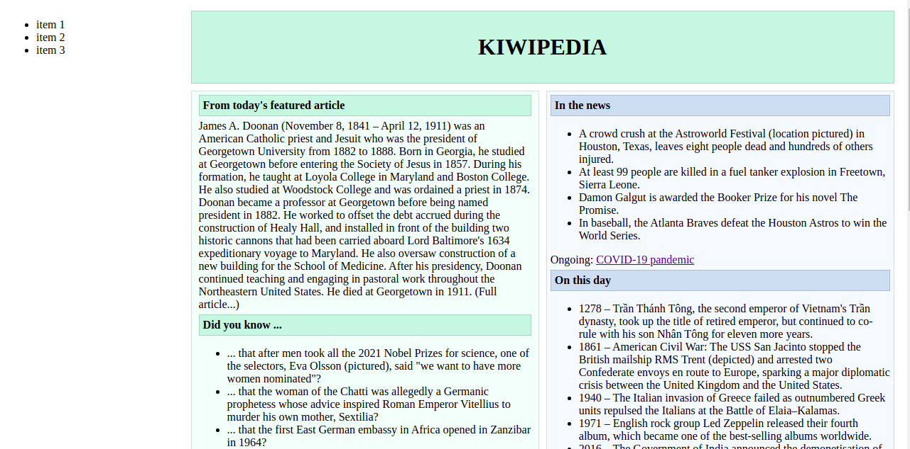
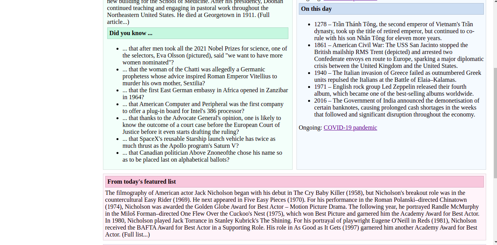
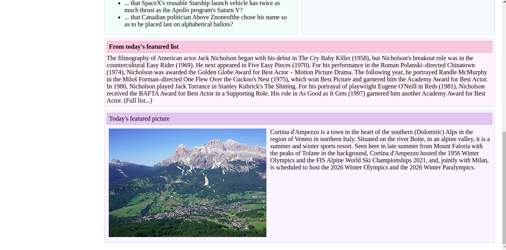

# TP 1 - Parcours Fullstack

*Durée : 1 à 2 semaines*

__Languages__ : HTML + CSS

__Objectif Principal__ : Reproduire le site donné (Wikipédia en simplifié)

__Notions visées__ :
- Comprendre ce qu'est HTML, à quoi ça sert, comment on s'en sert
- Comprendre ce qu'est CSS, à quoi ça sert, comment on s'en sert
- Comment combiner les deux langages pour créer des designs pas trop immondes
- Maitriser le fonctionnement de base HTML (tags classiques, metas, head...)
- Maitriser le CSS de base (ids, classes, tags, selectors)
- Maitriser les notions CSS "avancées" grid + flexbox

__Indications__:
- **Ne pas se lancer tête baisée dans le tp** : prenez le temps de découvrir les technos, comprendre à quoi ça sert, comment ça marche etc
- Bien réfléchir à comment sera découpé le site avant de commencer, c'est pas une fois que tu seras au milieu du code qu'il faudra commencer à se poser la question de comment on s'y prend
- Faire des **commits** :)
- Envoyez-moi le lien git quand vous l'avez créé

(Pas de pression hein, c'est du bonus, le but est de découvrir pas de se dégouter)

Have fun

