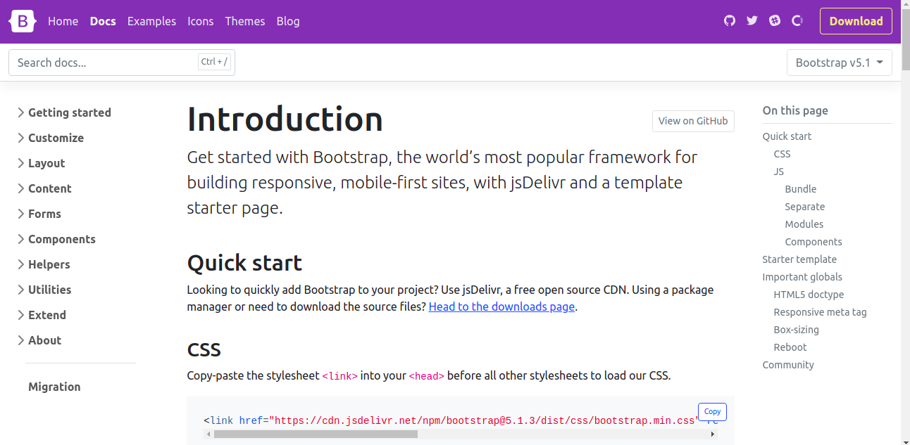

# TP 3 - Parcours Fullstack

*Durée : 1 à 2 semaines*

__Languages__ : HTML + CSS

__Objectif du TP__ : Découvrir les Frameworks CSS

__Notions visées__ :
- Comprendre l'intérêt d'un framework css et ses limitations
- Comprendre le système de grid commun à de nombreux frameworks
- Savoir créer une interface propre et claire rapidement
- Appréhender les bases du **responsive design**

__Indications habituelles__ :
- **Ne pas se lancer tête baisée dans le tp** : prenez le temps de découvrir les technos, comprendre à quoi ça sert, comment ça marche etc
- Bien réfléchir à comment sera découpé le site avant de commencer, c'est pas une fois que tu seras au milieu du code qu'il faudra commencer à se poser la question de comment on s'y prend
- Faire des **commits** avec des messages **propres** :)
- Envoyez-moi le lien git quand vous l'avez créé

__Énoncé__ :

- Tout comme pour le TP1, ce tp consiste en la reproduction d'une page d'un site web déjà existant.
Le site à reproduire est la page **[Get Started](https://getbootstrap.com/docs/5.1/getting-started/introduction/)**
  du site de Bootstrap.

- Essayer d'être le plus fidèle possible par rapport au site d'origine.
- Possibilité d'utiliser **[FontAwesome](https://fontawesome.com/)** ou autre pour les icones

__Restrictions__ :
- Obligation d'utiliser un framework css (Boostrap est recommandé)

(Pas de pression hein, c'est du bonus, le but est de découvrir pas de se dégouter)

Have fun
