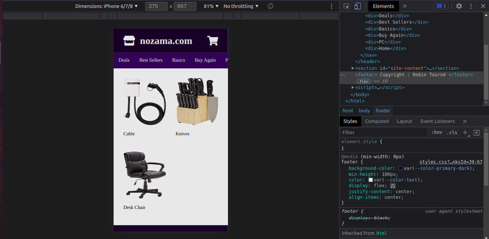
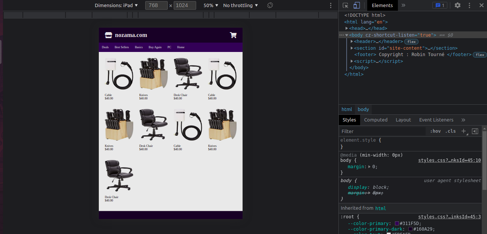
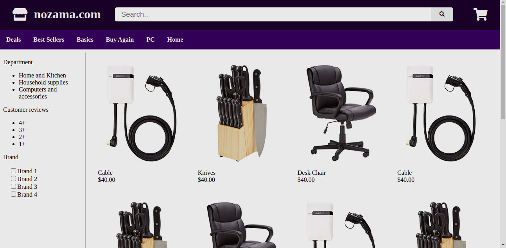

# TP 4 - Parcours Fullstack - Responsive

*Durée : 1 à 2 semaines*

__Languages__ : HTML + CSS

__Objectif du TP__ : Mettre en place une interface responsive

__Notions visées__ :
- Comprendre ce qu'est une interface responsive
- Savoir adapter son interface à tout type d'écrans
- Comprendre l'intérêt du "Mobile first"
- Comprendre le concept de Breakpoints
- Manipuler les media queries

__Indications habituelles__ :
- **Ne pas se lancer tête baisée dans le tp** : prenez le temps de découvrir les technos, comprendre à quoi ça sert, comment ça marche etc
- Bien rechercher en amont les différents outils notions dont vous pourriez avoir besoin pour réaliser le tp
- Faire des **commits** avec des messages **propres** :)

__Énoncé__ :
- Le but de ce tp est de reproduire les maquettes données.
- Il s'agit d'une seule et même page qui s'adapte en fonction de la taille d'écran de l'utilisateur
- Vous pouvez soit utiliser un framework css, soit partir en css pur
- À vous de déterminer les différents breakpoints à utiliser

(Pas de pression hein, c'est du bonus, le but est de découvrir pas de se dégouter)

Have fun

Maquettes :
Smartphone

Tablettes

PC

