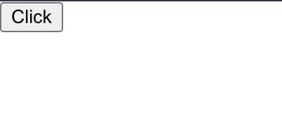
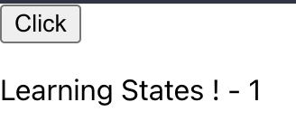

# React #0 Basics #3 states

# Ressources

https://reactjs.org/docs/hooks-state.html

# Consignes

- A partir de la documentation react fournie, transformer la variable greetings en state (string) avec comme valeur
  initiale une string vide
- A l aide de la prop `onClick` du bouton, faire en sorte que lorsque le bouton est cliqué, notre state `greetings` soit
  set à "Learning States !"
- Creer un nouveau state appelé `count` avec pour valeur initiale 0
- Faire en sorte d afficher le nombre de fois ou le bouton à été cliqué
- Faire en sorte de n afficher le count que lorsque le bouton a déjà été cliqué au moins une fois.

ATTENTION : Pour set la nouvelle valeur du count, faire attention a bien utiliser le state precedent fourni dans la
fonction setState

```ts
setCount(prevState => prevState + 1) // ✔ OK
setCount(count + 1) // ❌ NON
count = count + 1 // ❌ ENCORE MOINS
```

# Resultat attendu

Nb de clics: 0


Nb de clics: 1


